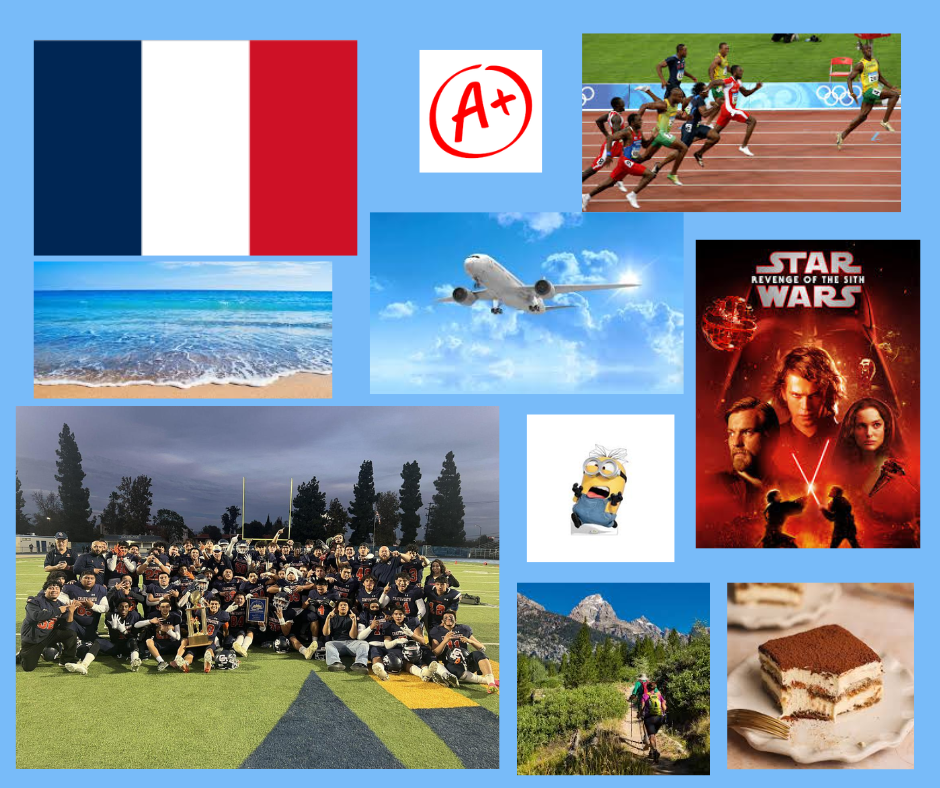

# ME-in-markdown

## Introduction
Hello, my name is Simon Blondeau I am 15 years old my birthday is March 12 2010 and I attend Chatsworth Highschool. I am the starting saftey on the varsity team wearing number 33. I have been in the magnet program my whole school career starting at Balboa elementary school then going to Lawrence middle school. I am very interested in sports escpecially in soccer and football. My favorites subject in school is history becasue I love all of the action in the stories and I also love doing hands on activities in every class.

A fun fact about myself is that I have been doing sports since I was young. I started with soccer playing at mason park, I then added track and field to my schedule to become faster. I have been doing track since while usually running short distances and hurdles. I stopped playing soccer in 6th grade and picked up with flag football for two years. I payed my first season of tackle back in 8th grade and loved playing, once I came to Chatsworth I tried out for the football and made the team. Later in the season I got moved up to play with varsity and we won the city championship!

My expectations for this class is to become very organized in balanceing my classwork to not be stressed throughout the two semesters. I want to be able to learn and understand as much as I can of this subjet as I can. I want to be able to have fun while coding and creating things through the computer. Lastly want to know the material to be able to pass the AP test at the end of the year. 
## Playlist

https://open.spotify.com/playlist/2OTFNzLkK3UksGk11bwUDu

## My Collage

